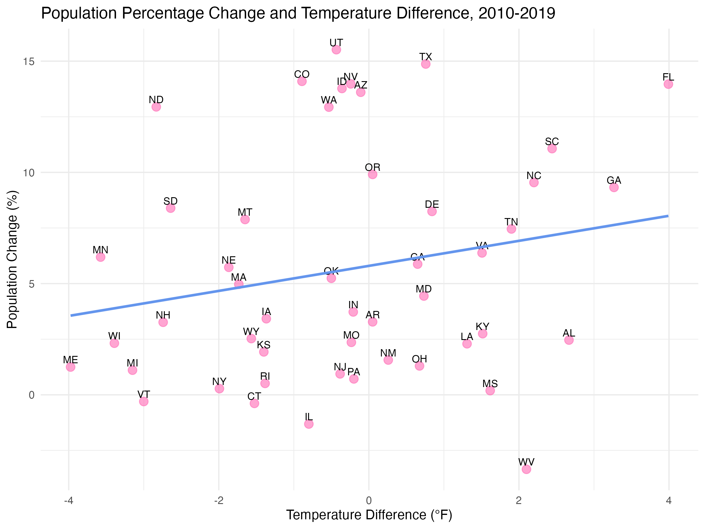

Introduction

Does an increase in temperature influence population migration trends? In this study, I plan to examine the effect that annual temperature change has on state populations over time. I hypothesize that more significant changes in temperature over time lead to a decrease in population. In states that experience a greater rate of increase in annual temperature, I would expect that their state population would remain stable or decline in comparison to states without temperature increase. My sample is comprised of the annual temperature from 1895-2019 in the continental United States, subset to the years between 2010 and 2019. The other data set is the census population data for each continental state of those same years. My unit of analysis is states. The explanatory variable of interest is the rate of increase in annual temperature of the states. My outcome variable is the population change over time. The sample will use data from a Washington Post repository measuring temperature trends by state between 1895 and 2019. The other set comes from the US Census website’s public data for 2010 and 2019. If I observe that there is higher migration out of those states that have experienced greater temperature increase, this would support my hypothesis. However, if I observe no discernible relationship or a positive relationship (both increase), this would disprove my hypothesis.

If my hypothesis is supported, showing that states experiencing greater temperature increases have stable or declining populations, the implications could be significant. Such findings would highlight the role of climate change in driving migration, urging policymakers to prioritize resources for communities losing population due to rising temperatures. This could include taking measures like physically reinforcing infrastructure or economic restructuring to support already affected areas. Additionally, this would reinforce the urgency with which we should be reducing emissions and investing in climate-resilient infrastructure to mitigate the social and economic impacts of climate-driven migration. On the other hand, if I find no significant relationship, or if temperature increases correlate with population growth, this would suggest that migration decisions are more complex and influenced by factors beyond temperature, such as economic opportunities or quality of life. It could also indicate that populations in these states are more resilient than anticipated or that current state-level mitigation efforts are addressing climate impacts more effectively than speculated. Regardless of the outcome, this research topic should continue to be studied for the potential insights into how states might better address the effects of climate change.


Data

The temperature data comes from a dataset within a public Washington Post repository. The repository is called “data-2C-beyond-the-limit-usa,” and the dataset was a csv file called “climdiv_state_year.csv” under the processed data folder. The data was committed four years ago by contributor John Muyskens. https://github.com/washingtonpost/data-2C-beyond-the-limit-usa.

The state data comes from the U.S. Census Bureau website, and the specific citation is provided below:

U.S. Census Bureau. "Annual Estimates of the Resident Population: April 1, 2010 to 
  July 1, 2019." Population Estimates, PEP Population Estimates, Table PEPANNRES,       2019, https://data.census.gov/table/PEPPOP2019.PEPANNRES?g=010XX00US$0400000&y=2019.

To analyze the relationship between temperature changes and population trends, I began by cleaning and restructuring the datasets. Using temperature data from 1895-2019, I filtered for annual state-level temperatures from 2010 to 2019. The dataset was reshaped so that temperature values for each year became individual columns, allowing me to calculate the temperature difference between 2010 and 2019 for each state. A census dataset containing state-level populations was similarly processed: I filtered out non-continental states and transformed population estimates for 2010 and 2019 into numeric values. I computed the percentage change in population over the same period for each state. Finally, I merged these datasets, aligning the temperature change and population change metrics by state to create a comprehensive analysis-ready dataset.


```{r, echo = FALSE}
library(readr)
library(tibble)
library(dplyr)
library(tidyr)

data <- read_csv(
  "/Users/maggiecaraher/Documents/GitHub/data-2C-beyond-the-limit-usa/data/processed/climdiv_state_year.csv")
temp_data <- data |>
  filter(year >= 2010 & year <= 2019) |>
  select(fips, year, temp)

temp_data_new <- temp_data |>
  pivot_wider(names_from = year,
              values_from = temp,
              names_prefix = "temp_")
```
```{r, echo = FALSE}
fips_states <- tibble(
  fips = c("01", "04", "05", "06", "08", "09", "10", "12", "13", "16", "17", "18", "19", "20", "21", "22", "23", "24", "25", "26", "27", "28", "29", "30", "31", "32", "33", "34", "35", "36", "37", "38", "39", "40", "41", "42", "44", "45", "46", "47", "48", "49", "50", "51", "53", "54", "55", "56"),
  states = c(
  "AL", "AZ", "AR", "CA", "CO", "CT", "DE", "FL", "GA", "ID", 
  "IL", "IN", "IA", "KS", "KY", "LA", "ME", "MD", "MA", "MI", 
  "MN", "MS", "MO", "MT", "NE", "NV", "NH", "NJ", "NM", "NY", 
  "NC", "ND", "OH", "OK", "OR", "PA", "RI", "SC", "SD", 
  "TN", "TX", "UT", "VT", "VA", "WA", "WV", "WI", "WY"
))

new_data_tibble <- fips_states |>
  left_join(temp_data_new, by = "fips")
```

```{r, echo = FALSE}
library(ggplot2)

temp_increase <- new_data_tibble |>
  mutate(temp_difference = temp_2019 - temp_2010) |>
  select(fips, temp_difference) |>
  left_join(fips_states, by = c("fips" = "fips"))

increasing_states <- temp_increase |>
  filter(temp_difference > 0)

decreasing_states <- temp_increase |>
  filter(temp_difference < 0)

sig_temp_plot <- ggplot(
  increasing_states, mapping = aes(
    x = reorder(
      states, temp_difference),
    y = temp_difference)) +
  geom_bar(stat = "identity", fill = "dodgerblue3") +
  labs(title = "State Temperature Increases from 2010-2019",
       x = "State",
       y = "Temperature Change in °F")
```

```{r, echo = FALSE}
data <- read.csv("~/Library/Mobile Documents/com~apple~CloudDocs/state_pops.csv")

state_pops <- data |>
  rename(states = Geographic.Area.Name..Grouping.) |>
  rename(estpop2010 = X7.1.2010.population.estimate..Population) |>
  rename(estpop2019 = X7.1.2019.population.estimate..Population) |>
  select(states, estpop2010, estpop2019)

cont_state_pops <- state_pops |>
  filter(!states %in% c("Alaska", "District of Columbia", "Hawaii", "Puerto Rico"))

state_abbreviations <- setNames(state.abb, state.name)

cont_state_pops <- cont_state_pops |>
  mutate(states = state_abbreviations[states])
```

```{r, echo = FALSE}
cont_state_pops <- cont_state_pops |>
  mutate(
    estpop2010 = as.numeric(gsub(",", "", estpop2010)),
    estpop2019 = as.numeric(gsub(",", "", estpop2019))
  )

cont_state_pops <- cont_state_pops |>
  mutate(pop_pct_change = ((estpop2019 - estpop2010) / (estpop2010) * 100))
```

```{r, echo = FALSE}
temp_pop_data <- temp_increase |>
  left_join(cont_state_pops, by = "states")
```

```{r, echo = FALSE}
temp_pop_knit <- knitr::kable(temp_pop_data,
             caption = "Temperature Difference and Population Change", 
             align = "c")
```

```{r, echo = FALSE}
temp_pop_knit
```

This table shows the difference in annual temperature between 2010 and 2019 in each state, as well as each state's estimated population in 2010, population in 2019, and percentage change between the two.

The key explanatory variable in this study is the temperature difference for each state between 2010 and 2019, measured in degrees Fahrenheit. The dependent variable is the percentage change in population for the same period, calculated as the relative increase or decrease from the 2010 baseline population.

My research design is before-and-after, because it compares the outcome variable (population change) at two points in time (2010 and 2019) to assess whether a change in the independent variable (temperature difference) is associated with the observed differences in the outcome. I am examining changes over time within states. My independent variable (temperature difference) and dependent variable (population change) are both measured at two distinct time points (2010 and 2019). It is not a cross-sectional design, because the design does not examine data at a single point in time. It is not a randomized experiment, because those require experimental manipulation, like randomly assigning treatment, which does not apply since my study is observational. It is not differences-in-differences, because my design does not define treatment and control groups.


Results

The relationship between those variables—temperature difference and percentage change in population—is visualized in the scatter plot below, where each point represents a state. The plot includes a fitted linear regression line, illustrating the general trend. Contrary to my hypothesis, the relationship appears slightly positive, suggesting that states with higher temperature increases tended to experience population growth rather than decline. This result challenges the notion that rising temperatures directly drive population decreases within the continental United States.

```{r, echo = FALSE, message = FALSE, warning = FALSE}
correlation <- cor(temp_pop_data$temp_difference, temp_pop_data$pop_pct_change)

data_scatter <- ggplot(
  temp_pop_data, aes(
    x = temp_difference,
    y = pop_pct_change)) +
  geom_point(aes(label = states), color = "hotpink", size = 3, alpha = 0.6) +
  geom_text(aes(label = states), vjust = -0.5, color = "black", size = 3) +
  geom_smooth(method = "lm", se = FALSE, color = "cornflowerblue") +
  labs(
    title = "Population Percentage Change and Temperature Difference, 2010-2019",
       x = "Temperature Difference (°F)",
       y = "Population Change (%)") +
  theme_minimal()

ggsave("data_scatter_plot.png", plot = data_scatter, width = 8, height = 6, dpi = 300)
```



This plot shows the relationship, by state, between the temperature difference (in Fahrenheit) between 2010 and 2019 and the population change (in percentage) from 2010 to 2019. The regression line included estimates of the effect of temperature change on population change. The observable relationship is slightly positive, disproving my thesis that the relationship between population change and temperature difference would be negative. It appears as though most of the states had some amount of population growth from 2010 to 2019, regardless of the temperature change.

The output for the main regression summarizes the relationship between population percentage change and temperature difference for the continental 48 states. The key components of the output are the coefficients, standard errors, and p-values.

```{r, echo = FALSE}
main_regression <- lm(
  pop_pct_change ~ temp_difference, data = temp_pop_data)

p_value <- summary(main_regression)$coefficients[2, 4]
p_value

modelsummary::modelsummary(
  main_regression, statistic = c(
    "s.e. = {std.error}", "p = {p.value}"),
  gof_map = c("nobs", "r.squared", "adj.r.squared"))

```

The intercept, which came out to be 5.797, is the estimated average population percentage change when the temperature difference is zero. In this case, a state with no temperature difference between 2010 and 2019 would experience an estimated 5.797% population growth. temp_difference, which came out to be 0.563, is the slope coefficient, representing the estimated change in population percentage per 1°F increase in temperature. For each additional 1°F rise in temperature difference, population growth is predicted to increase by 0.563 percentage points.

The standard errors, which indicate the uncertainty in the estimates, were 0.743 (for the intercept) and 0.392 (for temp_difference). The standard error of the intercept is small relative to its value, suggesting a precise estimate. The standard error of the temp_difference estimate is relatively large compared to its coefficient, indicating greater uncertainty about the true effect of temperature on population growth.

The p-value of the intercept, which was less than 0.001, indicates that the intercept is highly statistically significant. This means there is strong evidence that the average population change is not zero when the temperature difference is zero. On the other hand, the p-value of temp_difference came out to be 0.158. This p-value suggests the relationship between temperature difference and population change is not statistically significant at typical significance levels (0.01, 0.05, or 0.1). This means that the observed effect could plausibly be due to random variation rather than a true underlying relationship.

Other insights from the output include the number of observations, the R-squared value, and the adjusted R-squared value. The number of observations was 48, as that is the number of continental states included in my analysis. The R-squared value, which came out to 0.043, indicates that only 4.3% of the variation in population percentage change is explained by temperature difference. This is a very low value, suggesting the model doesn't capture much of the variability in the outcome. When adjusted for the number of predictors in the model, the R-squared value was 0.022, reaffirming the model’s minimal explanatory power.

The effect of temperature difference on population change is positive (0.563), but it is small and statistically insignificant (p = 0.158). There's insufficient evidence to claim a strong or reliable relationship between these variables. The low R-squared value suggests that other factors, beyond temperature difference, drive changes in population growth (e.g., economic opportunities, cost of living, political lean, etc.).


Conclusion

My hypothesis proposed that states experiencing greater increases in annual temperature over time (from 2010 to 2019) would see a decline or have insignificant change in population due to migration out of these states as a result of rising temperatures. I expected that states with more significant temperature increases would experience population loss, while states with little or no increase in temperature would either maintain or grow their population. This hypothesis was based on the assumption that rising annual temperatures would make living conditions less desirable, prompting people to migrate away from states that experienced the most temperature increases. However, the results of the regression analysis did not support this hypothesis. The correlation between the rate of temperature increase and population change was found to be negligible, with no statistically significant relationship observed. This suggests that there is no clear evidence linking temperature increase to population migration trends within the time frame (2010-2019).

